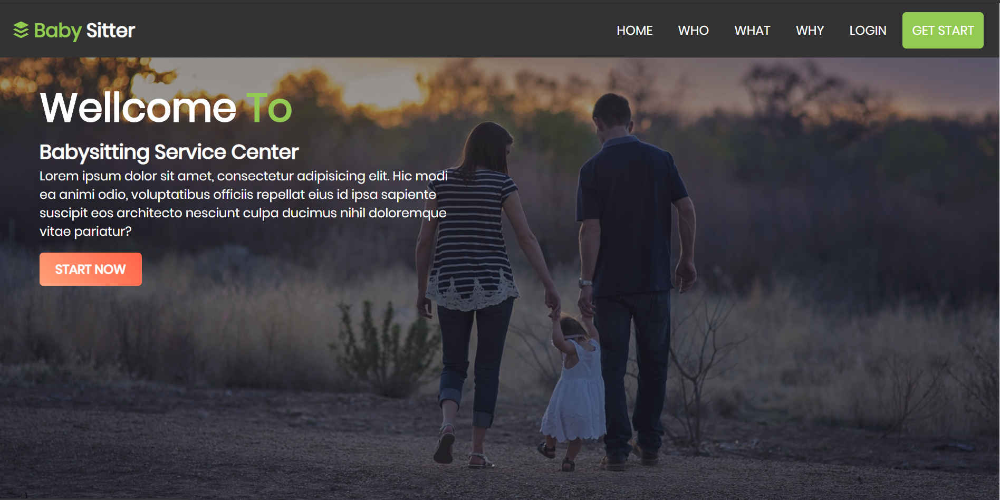

# Babysitter Service Center
### Basic Php Project

## About 

### Someone who takes care of your baby or child while you are out, Usually by coming to your home, Especially someone you pay to do this
---

## User Type

- Admin
- Parents
- Babysitter

---
## Features 

- Admin
    - Login
    - Manage Parents (approve,delete,disable)
    - Manage Babysitter(approve,delete,disable)
    - Manage Job Post (approve,delete)
    - Add another admin
    - Delete admin (can't delete Himself)
    - Change Password
    - Forget password
    - Logout

- Parents 
    - Registration
    - Login
    - Deposit money in the account
    - Post job(if have enough money in the account)
    - Hire Babysitter
    - account statistic
    - Change Password
    - Forget password
    - Logout

- Babysitter
    - Registration
    - Login
    - Withdraw Money from the account
    - Apply for Job
    - Contract with Parents
    - See account statistic
    - Change Password
    - Forget password
    - Logout

